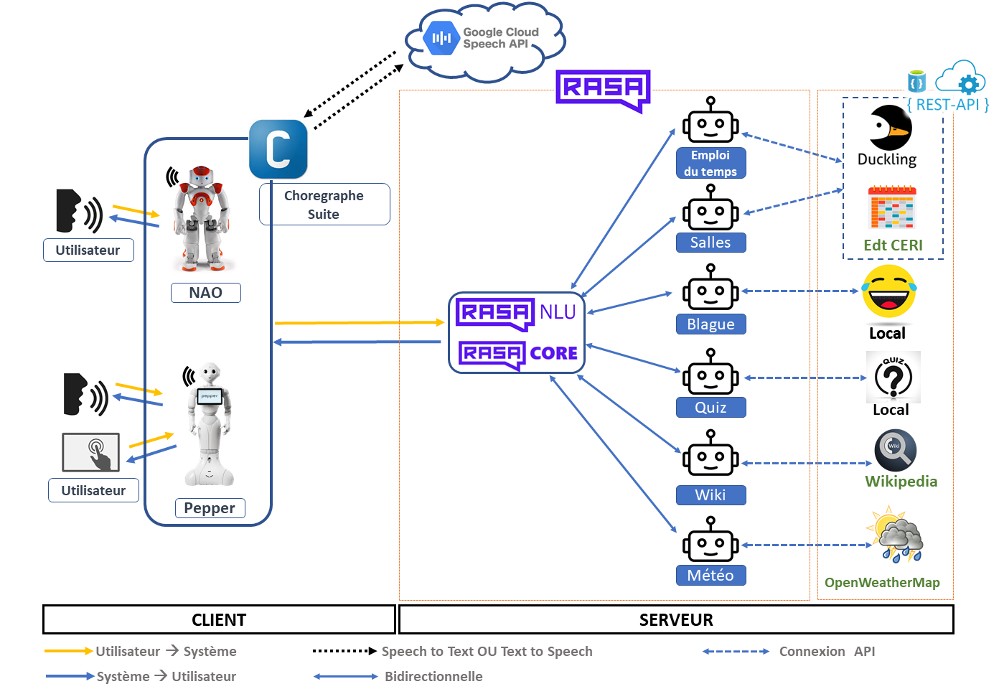

# Application d'innovation - Défi 1: Interactions vocales humain-machine

Ce projet contient la réalisation de notre équipe dans l'ECUE Application d'Innovation de l'UE Innovations et recherche pour la societe numerique. 

L'objectif de ce projet est de mettre en place une interface de dialogue homme-robot (vocal et visuel) en utilisant les capacités des robots humanoïdes programmables.
robots humanoïdes programmables : NAO et Pepper de SoftBank Robotics. La solution finale est un chatbot d ́eveloppé
en utilisant le framework open-source RASA et des techniques d'apprentissage automatique. Le chatbot est ensuite interfacé avec les deux robots pour servir d'agent d'accueil au Centre d'Enseignement et de Recherche en Informatique (CERI).
Les robots ont deux fonctionnalités principales :
la consultation de l'emploi du temps et la consultation des disponibilités
mais aussi quatre fonctions secondaires
socialisation : blagues, météo, wiki et quiz.

## Membres de l'équipe :

1- Abdoulaye SAYOUTI SOULEYMANE (M2 IA)

2- Houssainatou BAH (M2 ILSEN)

3- Miora RABEFANDROANA (M2 ILSEN)

## Description des répertoires
- **api** : contient les api 
- **ceribot** : contient le projet rasa
- **ceribot-choregraphe-project** : contient le projet choregraphe amélioré

